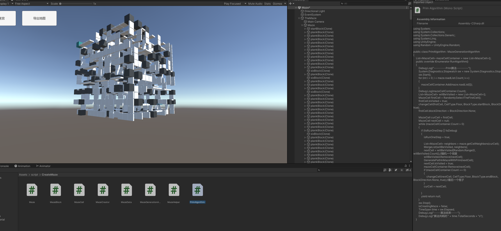

# PrimAlgorithm3D

3D迷宫prim算法的一种实现。



``` csharp
        List<MazeCell> willBeVisited = new List<MazeCell>();
        MazeCell firstCell = RandomlySelectTheFirstCell();
        firstCell.IsVisited = true;
        changeCell(firstCell, CellType.Floor, BlockType.startBlock, BlockDirection.Up, true);
        firstCell.blockDirection = BlockDirection.None;

        MazeCell curCell = firstCell;
        MazeCell nextCell = null;
        while (mazeCellContainer.Count > 0)
        {
            if (!isRunOneStep || !isDebug)
            {
                isRunOneStep = true;

                List<MazeCell> neighbors = maze.getCellNeighbors(curCell);
                MergeList(willBeVisited, neighbors);
                nextCell = willBeVisited[Random.Range(0, willBeVisited.Count)];//随机一个邻居
                willBeVisited.Remove(nextCell);
                GeneratePathInMazeWithPrim(nextCell);
                nextCell.IsVisited = true;
                mazeCellContainer.Remove(nextCell);
                if (mazeCellContainer.Count == 0)
                {
                    changeCell(nextCell, CellType.Floor, BlockType.endBlock, BlockDirection.None, true);//最后一个格子
                }
                curCell = nextCell;
            }
            yield return null;
        }
```
